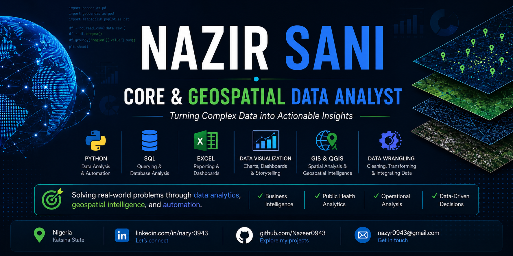

  

<h1 align="center">Nazir Sani</h1>

<h3 align="center">
Core & Geospatial Data Analyst • Public Health Intelligence • Trust & Safety
</h3>

Transforming complex data into actionable insights through analytics, geospatial intelligence, and responsible technology.

---

# 👨‍💻 About Me

I'm a **Core & Geospatial Data Analyst** passionate about transforming complex datasets into actionable insights that improve decision-making in public health, operations, and humanitarian programmes.

My expertise combines **Data Analytics, Geographic Information Systems (GIS), Monitoring & Evaluation (M&E), Python automation, and Trust & Safety** to build data-driven solutions for real-world challenges.

With a background in **IT Support** and **Trust & Safety**, I also advocate for responsible data practices, ethical technology, and reliable digital systems.

---

# 🚀 What I Do

📊 Transform raw data into actionable business and public health insights

🌍 Perform geospatial and spatial intelligence analysis

🏥 Support public health programmes through Monitoring & Evaluation (M&E)

📈 Build analytical dashboards, reports, and executive presentations

🐍 Automate data collection, cleaning, and transformation with Python

🛡 Promote responsible data use through Trust & Safety principles

---

# 🛠 Technical Skills

### Programming

- Python
- SQL

### Data Analytics

- Pandas
- NumPy
- Matplotlib
- Advanced Excel
- Power Query

### GIS & Spatial Analytics

- QGIS
- ArcGIS
- Spatial Analysis
- Cartography
- Coordinate Reference Systems (CRS)

### Public Health Analytics

- Monitoring & Evaluation (M&E)
- Operational Analytics
- Healthcare Intelligence
- Survey Analysis

### Trust & Safety

- Responsible Data Practices
- Digital Governance
- Platform Safety
- Ethical AI Awareness

---

# 🏆 Featured Projects

## 🏥 Public Health Outbreak Response Audit

Operational audit of an oral vaccine campaign using advanced Excel and Monitoring & Evaluation techniques to identify operational gaps, behavioural trends, and strategic recommendations.

**Tools**

Excel • XLOOKUP • Data Validation • Monitoring & Evaluation

🔗 **[Explore the Project](https://github.com/Nazeer0943/Data-Analytics-and-Geospatial-Portfolio/tree/main/project-marindi-immunization)**

---

## 🌍 Healthcare Accessibility Under Conflict Conditions

Award-winning GIS project analysing conflict intensity and healthcare accessibility across Nigeria to support humanitarian decision-making.

🥉 **3rd Place — DSN World GIS Map Challenge**

**Tools**

QGIS • Spatial Analysis • Cartography

🔗 **[Explore the Project](https://github.com/Nazeer0943/Data-Analytics-and-Geospatial-Portfolio/tree/main/project-gis-health)**

---

## 📈 Global-Mart Sales Audit

Retail analytics project focused on auditing transactional data, detecting anomalies, and producing executive business insights.

**Tools**

Python • Pandas • Matplotlib

🔗 **[Explore the Project](https://github.com/Nazeer0943/Data-Analytics-and-Geospatial-Portfolio/tree/main/01_Global_Mart_Sales_Audit_and_Analysis)**

---

## 👥 Customer Loyalty Analytics

Customer behaviour analysis using relational joins and exploratory analytics to identify customer retention opportunities.

**Tools**

Python • SQL • Data Transformation

🔗 **[Explore the Project](https://github.com/Nazeer0943/Data-Analytics-and-Geospatial-Portfolio/tree/main/02_Customer_Loyalty_Analysis)**

---

## 🌐 Automated Data Extraction Pipeline

Python-powered pipeline for extracting, cleaning, and structuring datasets from APIs and web sources.

**Tools**

Python • Requests • BeautifulSoup

🔗 **[Explore the Project](https://github.com/Nazeer0943/Data-Analytics-and-Geospatial-Portfolio/tree/main/project-web-scraping)**

---

# 💼 Professional Experience

- **User Support Specialist** — New Incentives
- **Trust & Safety Fellow** — Trust & Safety Africa Academy
- **Python Instructor** — Medics in Tech
- **Data Science Fellow** — Arewa Data Science Academy

---

# 📚 Certifications

- Google IT Support Professional Certificate
- Microsoft Career Essentials in Generative AI
- Professional Foundations in IT (ALX)
- Python Programming
- Data Literacy
- Artificial Intelligence Career Essentials

---

# 🌱 Currently Learning

- Advanced Geospatial Analytics
- PostGIS
- Power BI
- Data Engineering
- Machine Learning
- AI-assisted Analytics

---

# 🤝 Let's Connect

💼 **LinkedIn**

https://www.linkedin.com/in/nazyr0943/

📧 **Email**

[nazeer0943@gmail.com](mailto:nazeer0943@gmail.com)

🌍 **Portfolio Repository**

[Data Analytics & Geospatial Portfolio](https://github.com/Nazeer0943/Data-Analytics-and-Geospatial-Portfolio)

---

> **"Turning data into decisions through analytics, geography, and responsible technology."**
